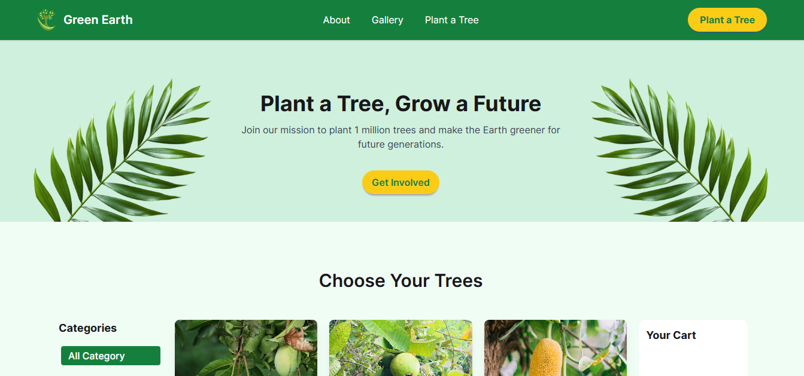
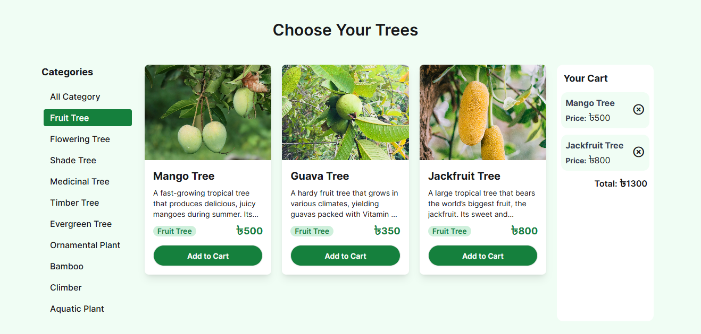
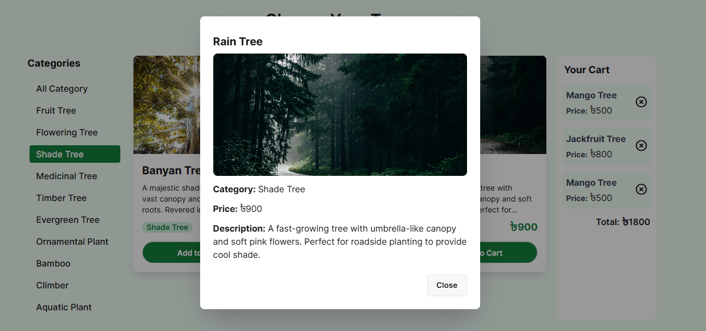
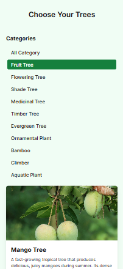

# Green Earth

A responsive web application that allows users to explore plants, filter them by categories, and view detailed plant information through a modern API-driven interface with interactive UI components.

---

## Overview

**Green Earth** is designed to promote environmental awareness and tree plantation by providing a smooth and interactive plant browsing experience.

The interface allows users to:

- Load and explore plant data dynamically from API
- Filter plants by categories
- View detailed plant information in a modal
- Add plants to a cart system
- Calculate total price dynamically
- Track and manage selected plants
- Interact with a fully responsive UI

The project was built with a strong focus on **API integration, dynamic DOM manipulation, clean UI design, and full responsiveness across mobile, tablet, and desktop devices.**

---

## Live Demo

🔗 [View Live Demo](https://green-earth-v2.netlify.app/)

---

## Tech Stack

| Layer       | Technology                  |
|-------------|------------------------------|
| Markup      | HTML5                        |
| Styling     | Tailwind CSS, Daisy UI      |
| Logic       | Vanilla JavaScript (ES6+)   |
| API         | Programming Hero Open API   |
| Icons       | Font Awesome                |

---

## Features
- **Plant Directory System** — Dynamically loads plant data from API in a responsive grid layout.
- **Category Filtering System** — Allows users to filter plants by category dynamically.
- **Plant Details Modal** — Shows full plant information when a plant card is clicked.
- **Add to Cart System** — Users can add plants to cart and view selected items.
- **Total Price Calculation** — Dynamically calculates total price of selected plants.
- **Remove from Cart Feature** — Users can remove items and update total instantly.
- **Loading Spinner** — Displays loader while fetching API data.
- **Responsive Navigation Bar** — Displays logo, menu items, and "Plant a Tree" button across all devices.
- **Hero Banner Section** — Full background image with centered title, subtitle, and CTA button.
- **About Campaign Section** — Two-column layout with image and description.
- **Our Impact Section** — Displays campaign statistics using interactive cards.
- **Active Category Highlight** — Highlights selected category button.
- **Fully Responsive Layout** — Optimized for mobile, tablet, and desktop devices.

---

## Key Highlights

- Built a **dynamic API-based plant browsing system** using Vanilla JavaScript
- Implemented **category-based filtering with live data rendering**
- Created a **modal system for detailed plant view**
- Designed a **cart system with real-time price calculation**
- Used **Tailwind CSS + DaisyUI for responsive UI design**
- Achieved **clean, reusable, and modular JavaScript structure**
- Ensured **fully responsive experience across all screen sizes**

---

## UI Screenshots

<table>
  <tr>
    <td align="center"><b>Home Page</b></td>
    <td align="center"><b>Plant Cards Section</b></td>
  </tr>
  <tr>
    <td></td>
    <td></td>
  </tr>
  <tr>
    <td align="center"><b>Cart & Modal View</b></td>
    <td align="center"><b>Mobile Responsive View</b></td>
  </tr>
  <tr>
    <td></td>
    <td></td>
  </tr>
</table>

---

## Usage Guide

| Action | Result |
|---|---|
| Click a category | Loads plants from that category |
| Click plant card | Opens plant detail modal |
| Click Add to Cart | Adds plant to cart list |
| Click remove icon | Removes plant and updates total |
| Wait during loading | Shows spinner while data loads |

---

## Future Improvements

- Store cart data using local storage
- Add search functionality for plants
- Add dark mode support
- Add smooth scroll/routing for About, Gallery, and Plant Tree sections.
- Add backend integration for orders and users

---

## Author

**A S M Saim**
- GitHub: [@asm-saim](https://github.com/asm-saim)
- LinkedIn: [A S M Saim](https://www.linkedin.com/in/asmsaim/)